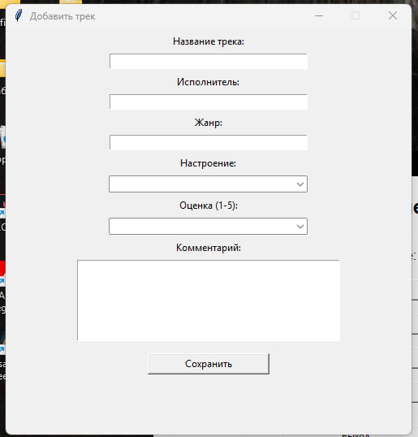
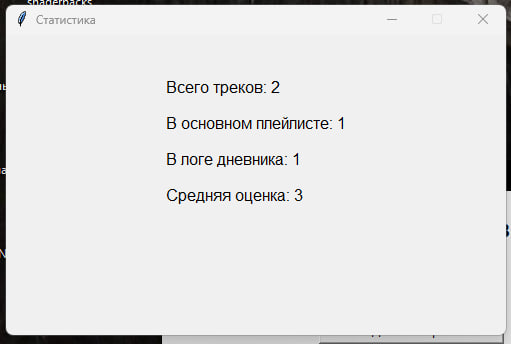
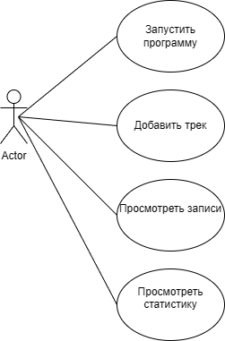
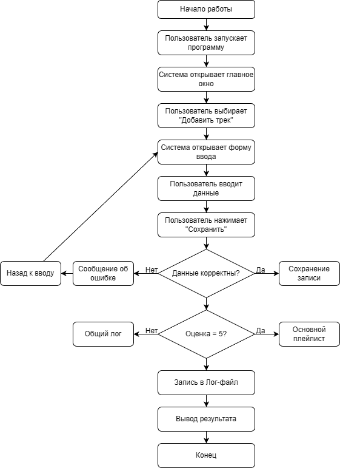

# Музыкальный дневник от F7R

``` Программа для сохранения и анализа прослушанных музыкальных треков, разработанная на Python ```


##  Описание проекта

> Музыкальный дневник — это приложение с графическим интерфейсом, предназначенное для ведения записей о прослушанных композициях.


##  Структура проекта

```
music-diary-app/
│
├── main.py
├── README.md
├── main_window.jpg
├── add_track.jpg
├── stats.jpg
├── use_case.png
├── flowchart.png
```


## Пользователь может:

- [x] добавлять треки;
- [x] выставлять оценку по шкале от 1 до 5;
- [x] просматривать список всех записей;
- [x] анализировать статистику.

## Особенность:

* оценка **5** → трек попадает в основной плейлист
* оценка **ниже 5** → запись попадает в общий журнал
---
Все данные сохраняются в файл **JSON**, а действия пользователя записываются в лог-файл.


##  Возможности

* добавление новых треков
* оценка треков (1–5)
* автоматическое распределение записей
* просмотр всех записей
* просмотр основного плейлиста
* просмотр статистики
* логирование действий


##  Интерфейс программы

### Главное окно


### Добавление трека



### Статистика




##  Диаграммы

### Use Case диаграмма



### Блок-схема программы




##  Технологии

* Python
* Tkinter
* JSON
* logging

---
